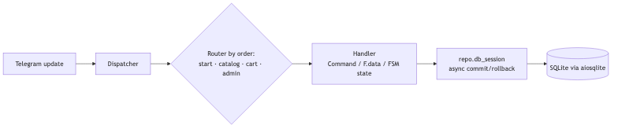
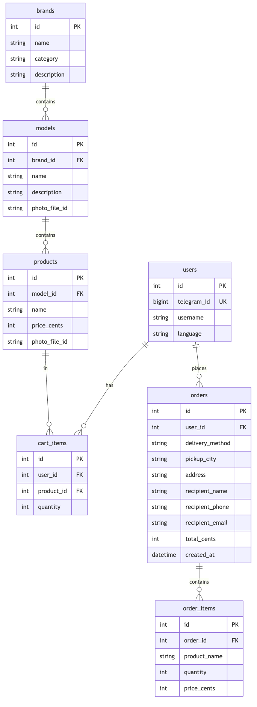

# Telegram Storefront Bot

A multilingual Telegram shopping bot: customers browse a catalog
(**category → brand → product line → product**), build a cart, and place an
order with a choice of mail delivery or in-person pickup. Completed orders are
pushed to every admin chat. Store owners manage the catalog entirely from inside
Telegram via an inline **/admin** panel — no separate dashboard.

It's a **storefront + order intake**, not a payment gateway: orders are recorded
and the admins are notified; fulfilment happens off-platform.

> This repository is a **fully self-contained demo** built to showcase the
> architecture. It ships with a fictional coffee & tea catalog and an empty
> database. A variant of this codebase runs in production for a real retail
> client; that deployment, its data, and its branding are not part of this repo.

## Design decisions at a glance

The full reasoning is in [`docs/ARCHITECTURE.md`](docs/ARCHITECTURE.md); the
short version:

| Decision | Why | Alternative I didn't take |
| --- | --- | --- |
| **Order lines are snapshots** (name + price copied into `order_items`) | A receipt must show what the customer actually paid, even after the product is renamed, repriced or deleted. | A foreign key to `products.id` — history would silently change with the catalog. |
| **Money as integer cents** | No float rounding errors in totals. The admin price parser accepts `24,50`, `24.50` and `€24.50`. | `float` or `Decimal` columns. |
| **Self-migrating schema at startup**, with a guard | A deploy is just a code push, so there's no manual DB step. Rebuilding `brands` means `DROP TABLE`, which would cascade-delete the whole catalog if SQLite FK enforcement were on, so the migration checks and refuses to run. | Alembic: the right tool for a growing schema, but too much for one table change. |
| **Translations fall back** `requested → English → key` | A missing translation shows English instead of crashing a handler or rendering a blank button. | Failing hard on missing keys. |
| **Router order is explicit** (`start → catalog → cart → admin`) | aiogram matches routers in registration order; this stops the catalog's broad callback filters from swallowing admin wizard steps. | Relying on import order. |

## Stack

- **Python 3.11**, [aiogram](https://docs.aiogram.dev/) 3.x — async, `Router`/FSM,
  inline keyboards, routing by `callback_data`.
- **SQLAlchemy 2.0** (async) + `aiosqlite` over **SQLite**.
- `python-dotenv` for config; `pytest` + `pytest-asyncio` for tests.
- Deploys as a long-polling worker (no webhook / HTTP port needed).

## Features

- 🌍 **Four UI languages** (en / ru / uk / nl) with a fallback chain.
- 🛍 **Catalog browsing** on inline keyboards — category → brand → line → product.
- 🧺 **Cart** with per-item quantity and a live total.
- ✅ **Checkout** — mail delivery (address + recipient details) or in-person
  pickup, with a minimum order for nearby-town pickup.
- 🔔 **Admin order notifications** to every configured admin chat.
- 🛠 **In-Telegram admin panel** — add / edit / delete brands, product lines,
  and products (including photos) through guided FSM flows.
- 💶 Money stored as **integer cents**; product photos stored as Telegram
  `file_id` (no filesystem).

See [`docs/ARCHITECTURE.md`](docs/ARCHITECTURE.md) for the data model (ERD),
request flow, and the key design decisions with their rationale.

**Request flow**



<p>
  <a href="docs/ARCHITECTURE.md">
    
  </a>
</p>

## Run it locally

You'll need a bot token from [@BotFather](https://t.me/BotFather) and your own
numeric Telegram ID (from [@userinfobot](https://t.me/userinfobot)).

```bash
python -m venv .venv && source .venv/bin/activate
pip install -r requirements-dev.txt

cp .env.example .env
# edit .env: set BOT_TOKEN and ADMIN_IDS (your own id)

python seed.py            # load the fictional coffee & tea catalog
python -m bot.main        # start long-polling
```

Then open your bot in Telegram and send `/start`. Send `/admin` (from an ID
listed in `ADMIN_IDS`) to manage the catalog.

### Configuration

| Variable           | Purpose                                                   |
| ------------------ | --------------------------------------------------------- |
| `BOT_TOKEN`        | Token from @BotFather. **Required.**                      |
| `ADMIN_IDS`        | Comma-separated Telegram user IDs with admin access.      |
| `DB_PATH`          | SQLite file path. Default `bot.db`.                       |
| `SUPPORT_USERNAME` | Telegram handle for the "Support" button. Default `demo_support`. |
| `PICKUP_CITY`      | City offered for in-person pickup. Default `Amsterdam`.   |

## Tests

```bash
pytest -v
```

24 tests cover the schema, the idempotent migration (including its
foreign-key-cascade guard), the repository layer, keyboard routing, and the
localization table.

## Project layout

```
bot/
  main.py          entrypoint: config, DB init, dispatcher, polling
  config.py        env-based configuration
  db/              SQLAlchemy models, async repository, migrations
  handlers/        start · catalog · cart · admin routers
  keyboards.py     inline keyboard builders
  locales/         translation table + t() helper
  states.py        FSM state groups (checkout, admin add/edit)
seed.py            loads the fictional demo catalog
docs/ARCHITECTURE.md
```

## Known limitations

- Checkout and admin wizard state live in `MemoryStorage`, so a flow that is in
  progress is lost on restart. Redis-backed FSM storage would fix this.
- It handles order intake only: there's no payment step and no stock counts.
- SQLite with a single writer is fine for one small shop. Postgres would be
  the next step if concurrency grows.

## License

[MIT](LICENSE).
