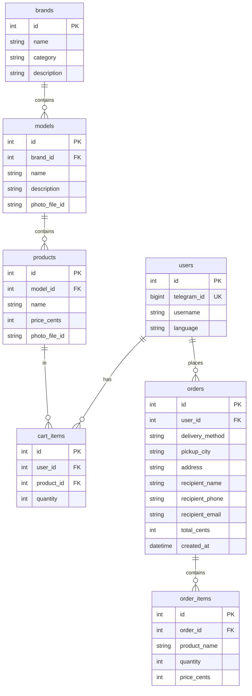
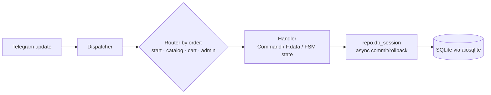

# Architecture & Design Notes

A case study of the storefront bot: the data model, how a Telegram update flows
through the system, and the design decisions worth explaining — with the
reasoning behind each one.

## The problem

A small retailer wanted to take orders through Telegram: browse a catalog, build
a cart, check out, and have the owner manage stock — without paying for a
separate web dashboard or a payments integration it didn't need yet. The bot had
to be cheap to run (single small worker), survive redeploys without manual
database surgery, and be operable end-to-end from a phone.

## Data model

Money is stored as **integer cents** everywhere; prices never touch floats.
Photos are stored as Telegram `file_id` strings, so the bot keeps no filesystem
of its own. A brand is unique per category (`UNIQUE(name, category)`), so the
same name can exist under, say, both *Coffee* and *Tea*.

Mermaid source for the ERD above

`cart_items` has `UNIQUE(user_id, product_id)` — re-adding a product bumps its
quantity instead of creating a duplicate row.

## Request flow

Navigation is entirely inline keyboards; each button carries a `callback_data`
string with a namespaced prefix (`cat:…`, `cart:…`, `co:…`, `adm:…`,
`addp:…`). Multi-step flows (checkout, the admin add/edit wizard) run on an FSM.

Mermaid source for the flow diagram above

## Key decisions

**1. Idempotent migrations without Alembic — with a cascade guard.**
Deploys are just a code push, so the schema self-migrates at startup:
`_run_migrations` adds missing columns and rebuilds the brand uniqueness
constraint, and it is safe to run on both a fresh and an already-migrated
database. Rebuilding the constraint means `DROP TABLE brands` — which, *if*
SQLite foreign-key enforcement were on, would cascade-delete every model and
product. SQLite ships with enforcement **off** by default (and `PRAGMA
foreign_keys` is a silent no-op inside a transaction), so rather than pretend to
toggle it, the migration reads the pragma and **refuses loudly** if enforcement
is ever on. Better a failed deploy than a silently emptied catalog. This is the
piece I'm most deliberate about — see the guard and its dedicated test.

**2. Order lines are snapshots.** `order_items` copies the product's name and
price at purchase time instead of referencing `products.id`. Order history then
survives later catalog edits, renames, and deletions — the receipt always shows
what the customer actually bought and paid.

**3. Money as integer cents + a tolerant parser.** All arithmetic is in cents.
Admin price input is forgiving: it accepts `24,50`, `24.50`, and `€24.50`,
normalizes separators, strips the currency symbol, and rejects negatives.

**4. Localization with a fallback chain.** `t(key, lang)` resolves
`requested language → English → the key itself`, so a missing translation
degrades gracefully to English and never crashes a handler or shows a blank
button.

**5. Router order is load-bearing.** aiogram checks routers in registration
order (`start → catalog → cart → admin`), and FSM-state handlers are matched
before generic callbacks. Keeping that order explicit is what stops the admin
wizard's steps from being swallowed by the catalog's broad `F.data` filters.

## What I'd change at scale

- **Persistent FSM storage.** Checkout/admin state lives in `MemoryStorage`, so
  an in-progress flow is lost on restart. Redis-backed storage would fix that.
- **Real migration tooling.** The hand-rolled migration is right for a
  single-table evolution; a growing schema wants Alembic's versioning and
  down-migrations.
- **Payments + inventory.** Today it's order intake only. A payment step and
  stock counts would be the next real features.
- **Postgres** if concurrency grows beyond what a single-writer SQLite file
  comfortably serves.

## Lessons

- The most valuable code here isn't a feature — it's the **guard around a
  destructive migration**. Encoding "refuse rather than risk data loss" as an
  assertion, plus a test that drives the exact failure condition, turned a latent
  landmine into a caught error.
- **Snapshotting order lines** cost one extra column set and removed an entire
  class of "history changed under me" bugs. Cheap denormalization at the right
  boundary pays for itself.
